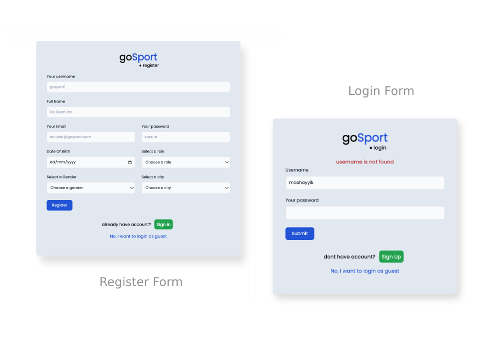
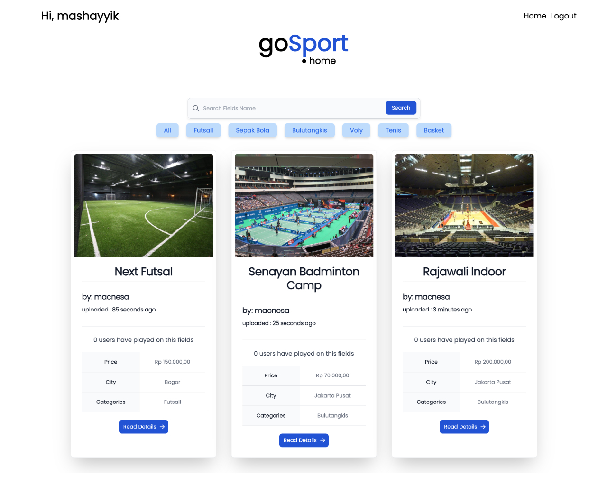
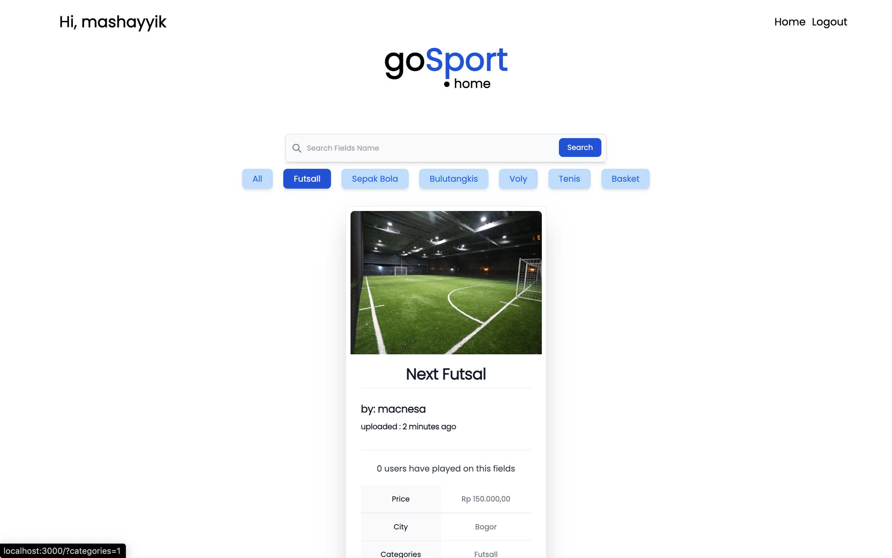
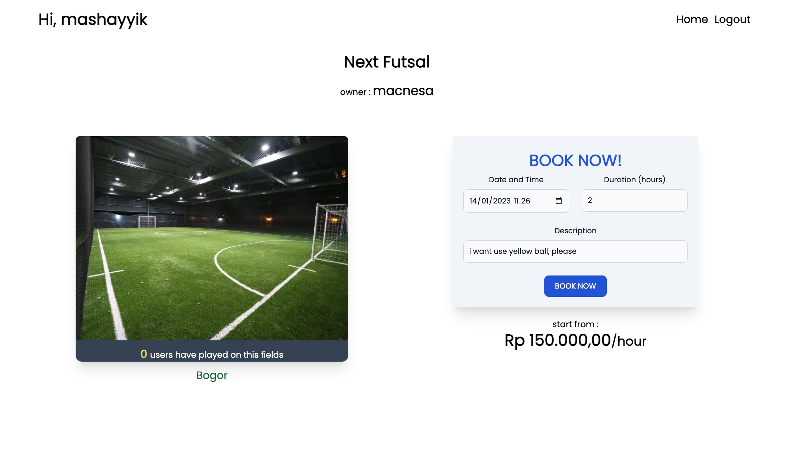
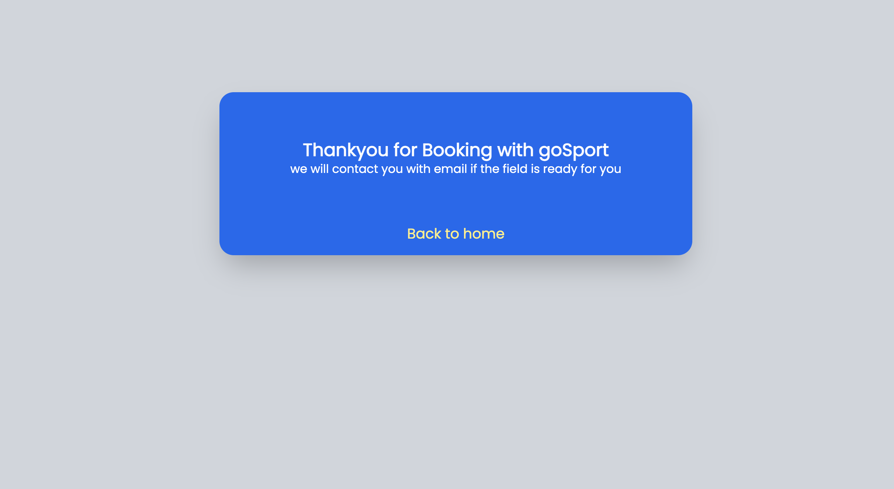
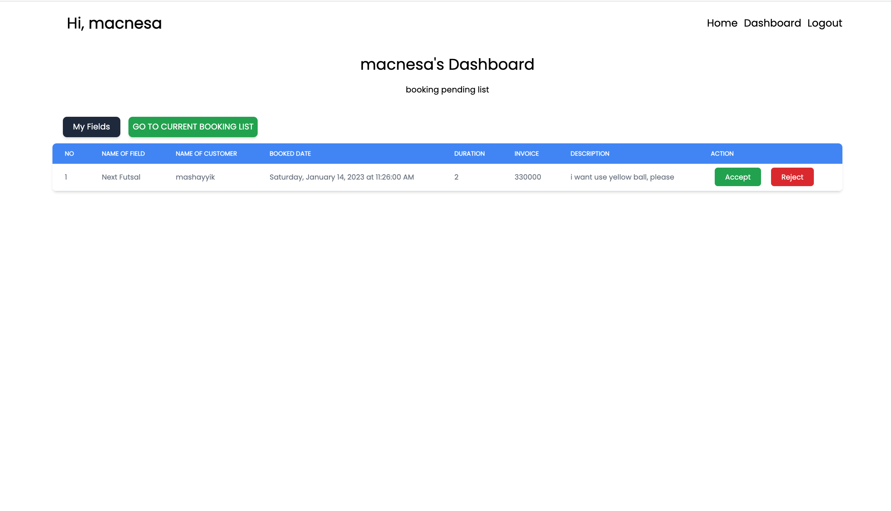
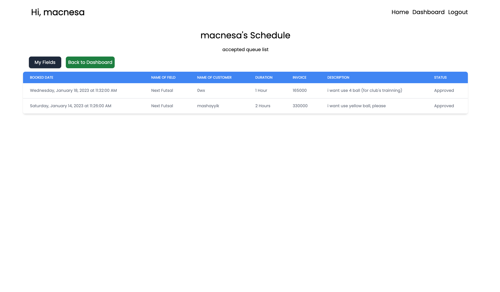
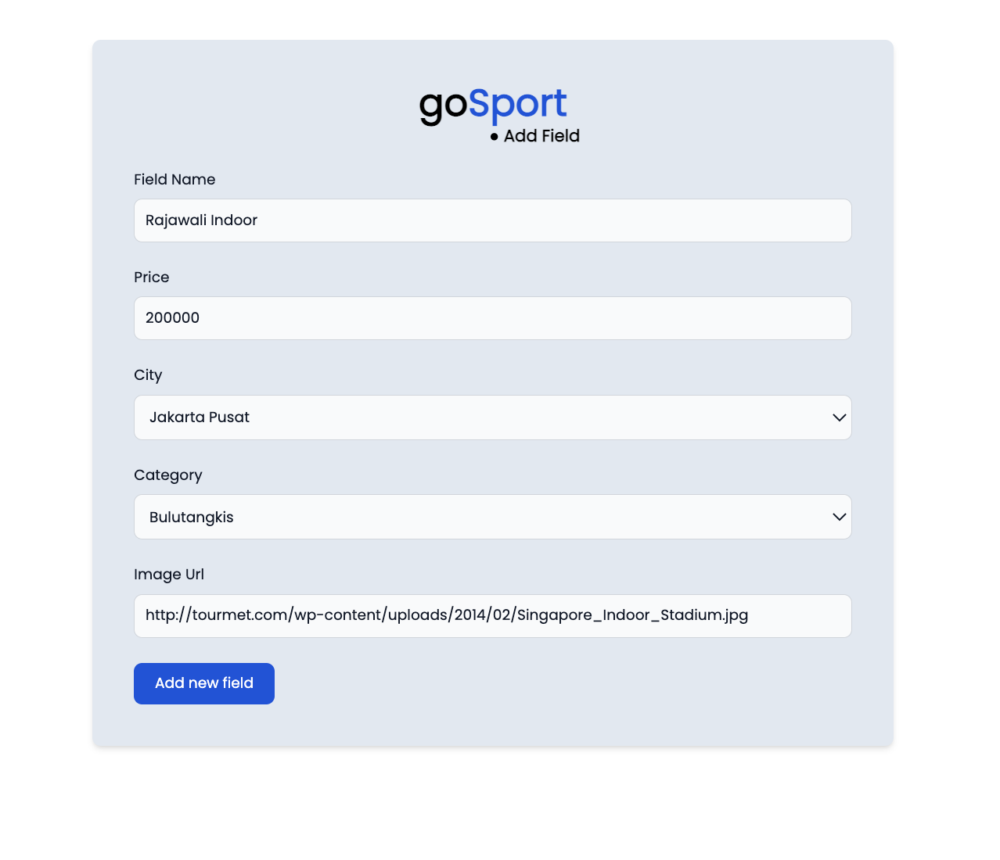
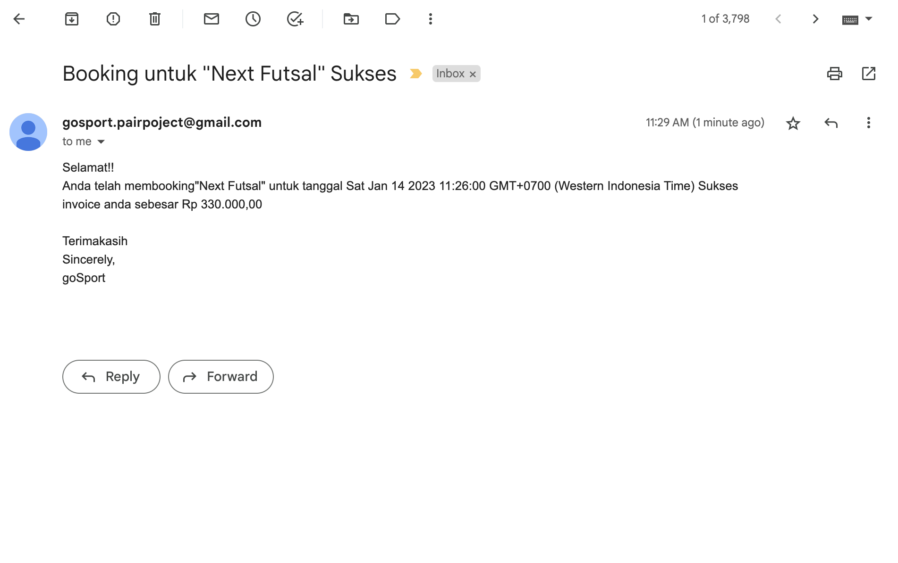

# goSport
Sport's Field Booking App

# Overview
https://gosport.brettkun.xyz

## Contributtor
1. Hayyik Lanaa R as Fullstack
2. Lintang Macnesa as Fullstack

## Feature
1. Login
2. Register
3. View Field list
4. Make New Transaction (user login required)
5. Add Field (provider login required)
6. Edit Field (provider login required)
7. Delete Field (provider login required)
8. Accept/Reject Transaction (provider login required)
9. Sending email when transaction has been updated by field's provider

## Specitification
1. Back-end     : NPM, Express.js, Bcryptjs, Nodemailer
2. Database     : Postgres SQL
3. ORM          : Sequelize
4. Middleware   : express-session, express static, express body parser
5. View Engine  : EJS
6. Front End    : EJS, Tailwindcss

## ERD Schema

## OVERVIEW
<figure>
 
  <figcaption>Login & Register Form</figcaption>
</figure>

<figure>

  <figcaption>Home Landing Page</figcaption>
</figure>

<figure>

  <figcaption>Home With Filtered Category</figcaption>
</figure>

<figure>

  <figcaption>Detail's Field Page</figcaption>
</figure>

<figure>

  <figcaption>Transaction Success (user login required)</figcaption>
</figure>

<figure>

  <figcaption>Dashboard (provider login required)</figcaption>
</figure>

  <figcaption>Dashboard Queue (provider login required)</figcaption>
</figure>

  <figcaption>Add Fields (provider login required)</figcaption>
</figure>

  <figcaption>Email Received to User when transaction is updated</figcaption>
</figure>
